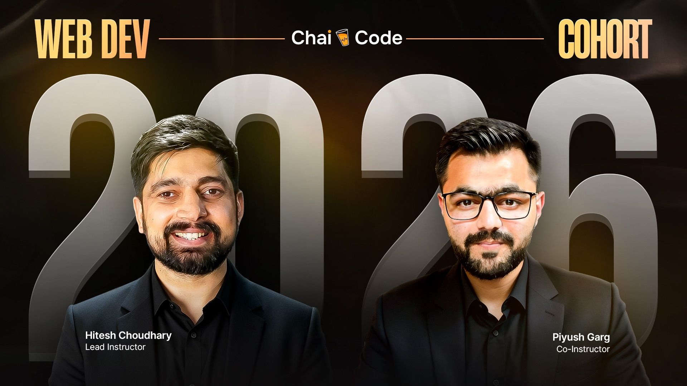

  

<h1 align="center">Chai Aur Cohort – 2026 (Pre-Cohort Phase)</h1>

  <strong>Status:</strong> Pre-Cohort Preparation Repository  
   
  <strong>Cohort Start Date:</strong> January 17, 2026

  
  
  
  
  
  

---

## Introduction

**Chai Aur Cohort** is a full-stack web development cohort led by  
**Hitesh Choudhary** Sir and **Piyush Garg** Sir.

This repository is created **before the official cohort begins** and is intended purely for **pre-cohort preparation and foundational discipline**.

The focus at this stage is **mindset, consistency, documentation habits, and learning readiness**, not advanced technical implementation.

---

## Purpose of This Repository

- Prepare mentally and structurally for the cohort
- Practice clean documentation and repository organization
- Build discipline around version control and consistency
- Maintain notes, learning references, and preparation material
- Enter the cohort with clarity and confidence

---

## Documentation Structure

This repository will gradually evolve and may include:

- **Notes** — Conceptual understanding and learning summaries
- **Assignments** — Practice exercises (once the cohort begins)
- **Projects** — Hands-on applications of learned concepts
- **Blogs / Learnings** — Personal reflections and insights

Structure will mature as the cohort progresses.

---

## Contribution Guidelines

Suggestions and improvements are welcome.  
Please refer to `CONTRIBUTING.md` for contribution standards and workflow.

---

## License

This repository is licensed under the **MIT License**.

You are free to:

- Learn from it
- Fork it
- Build upon it
- Share it responsibly

---

### ⭐ If you find this repository helpful, feel free to star it.

---

  Maintained by <strong>Harsh Guleria</strong>

