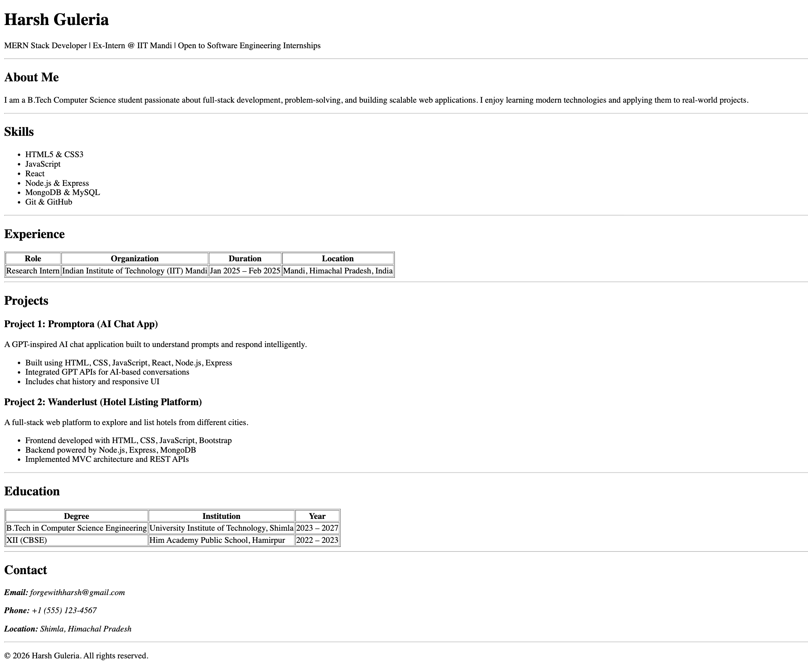

# HTML Resume Page Assignment

This project is a single-page resume website built using **semantic HTML** as part of the Web Dev Cohort assignment.

## Features

- Clean, single-page resume layout
- Proper use of semantic HTML tags
- Structured sections: About, Skills, Experience, Projects, Education, Contact

## Tech Stack

- HTML5

## Screenshot



## Setup & Usage

1. Clone the repository

   ```bash
   git clone <your-repo-url>

   ```

2. Navigate to the project folder:

   ```bash
   cd <your-repo-folder>

   ```

3. Open `index.html` in any web browser

## License

This project is open-source and available under the [MIT License](https://github.com/forgewithharsh/chai-aur-cohort-2026-prep/blob/main/LICENSE)
