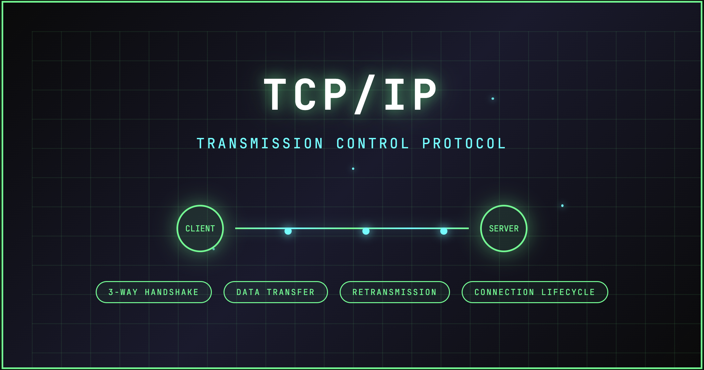
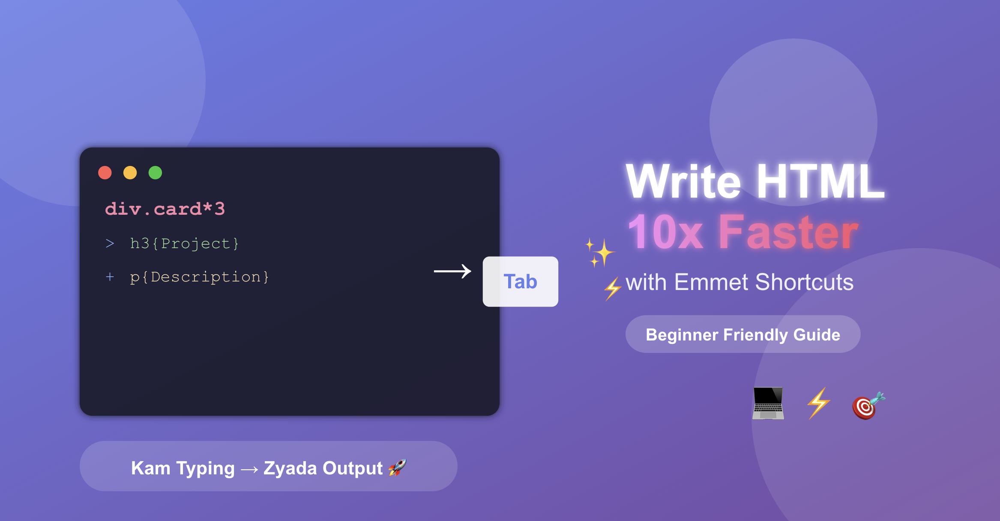
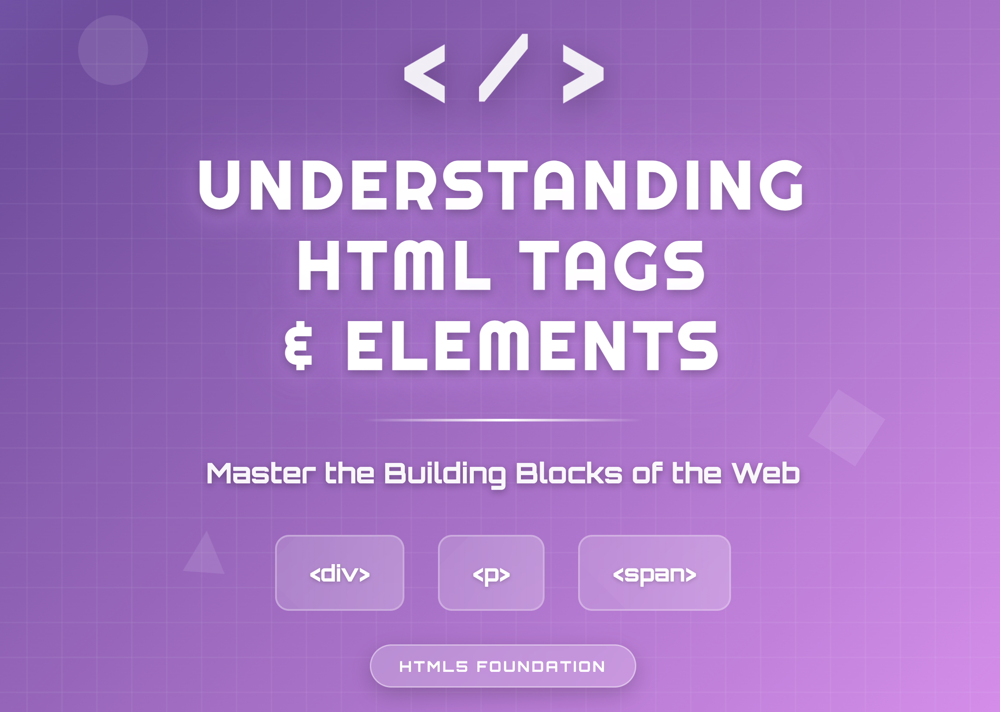
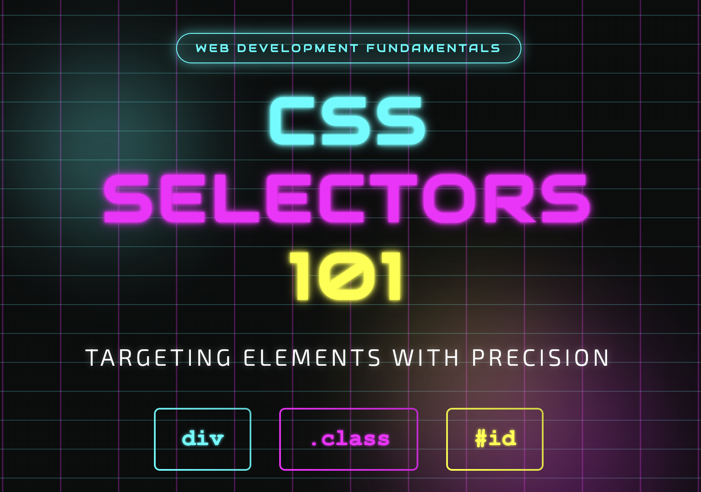

## Blogs Archive – Web Dev Cohort 2026

A structured collection of technical articles documenting my journey toward building **strong engineering fundamentals**.

&nbsp;&nbsp;

These blogs focus on **core web concepts, networking fundamentals, and essential programming principles**, explained with clarity and practical intuition. The goal is not just to learn, but to **understand deeply and articulate precisely**.

---

## Assignment Mapping (Web Dev Cohort 2026)

### 1. Git
- Git for Beginners: Basics and Essential Commands  
- Inside Git: How It Works and the Role of the `.git` Folder  
- Why Version Control Exists: The Pendrive Problem  

### 2. Networking
- CURL Command-Line Tool: Explained for Beginners  
- Understanding Network Devices: Modem, Router, Switch Explained Simply  
- TCP vs UDP: When to Use What, and How TCP Relates to HTTP  
- TCP Working: 3-Way Handshake & Reliable Communication  

### 3. DNS
- How DNS Resolution Works  
- DNS Record Types Explained  
- How to Connect a Custom Domain to Hashnode  

### 4. HTML / CSS
- Emmet in HTML for Beginners  
- Understanding HTML Tags and Elements  
- CSS Selectors 101: Targeting Elements with Precision
- How a Browser Works: A Beginner-Friendly Guide to Browser Internals

---

## Writing Philosophy

### What This Collection Represents
- A learning log backed by hands-on exploration  
- Clear, beginner-friendly explanations of foundational topics  
- Emphasis on **why** things work, not just **how**  
- Concepts broken down using real-world analogies and visuals  

### Writing Approach
Each article is written after deliberate study and experimentation, with a focus on:
- Simplicity over jargon  
- Accuracy over abstraction  
- Fundamentals over frameworks 

---

## Read the Blogs

### &star; Git

### [Git for Beginners: Basics and Essential Commands](https://learn-with-harsh.hashnode.dev/git-for-beginners-basics-and-essential-commands)
<a href="https://learn-with-harsh.hashnode.dev/git-for-beginners-basics-and-essential-commands">
  

    
  

</a>

 

### [Inside Git: How It Works and the Role of the .git Folder](https://learn-with-harsh.hashnode.dev/inside-git-how-it-works-and-the-role-of-the-git-folder)
<a href="https://learn-with-harsh.hashnode.dev/inside-git-how-it-works-and-the-role-of-the-git-folder">
  

    
  

</a>

 

### [Why Version Control Exists: The Pendrive Problem](https://learn-with-harsh.hashnode.dev/why-version-control-exists-the-pendrive-problem)
<a href="https://learn-with-harsh.hashnode.dev/why-version-control-exists-the-pendrive-problem">
  

    
  

</a>

---

### &star; Networking

### [CURL Command-Line Tool : Explained for Beginners](https://learn-with-harsh.hashnode.dev/curl-command-line-tool-explained-for-beginners)
<a href="https://learn-with-harsh.hashnode.dev/curl-command-line-tool-explained-for-beginners">
  

    
  

</a>

 

### [Understanding Network Devices: Modem, Router, Switch Explained Simply](https://learn-with-harsh.hashnode.dev/understanding-network-devices-modem-router-switch-explained-simply)
<a href="https://learn-with-harsh.hashnode.dev/understanding-network-devices-modem-router-switch-explained-simply">
  

    
  

</a>

 

### [TCP vs UDP: When to Use What, and How TCP Relates to HTTP](https://learn-with-harsh.hashnode.dev/tcp-vs-udp-when-to-use-what-and-how-tcp-relates-to-http)
<a href="https://learn-with-harsh.hashnode.dev/tcp-vs-udp-when-to-use-what-and-how-tcp-relates-to-http">
  

    
  

</a>

 

### [TCP Working: 3-Way Handshake & Reliable Communication](https://learn-with-harsh.hashnode.dev/tcp-working-3-way-handshake-and-reliable-communication)
<a href="https://learn-with-harsh.hashnode.dev/tcp-working-3-way-handshake-and-reliable-communication">
  

    
  

</a>

---

### &star; DNS

### [How DNS Resolution Works](https://learn-with-harsh.hashnode.dev/how-dns-resolution-works)
<a href="https://learn-with-harsh.hashnode.dev/how-dns-resolution-works">
  

    
  

</a>

 

### [DNS Record Types Explained](https://learn-with-harsh.hashnode.dev/dns-record-types-explained)
<a href="https://learn-with-harsh.hashnode.dev/dns-record-types-explained">
  

    
  

</a>

 

### [How to Connect a Custom Domain to Hashnode](https://learn-with-harsh.hashnode.dev/how-to-connect-a-custom-domain-to-hashnode-beginner-friendly-guide)
<a href="https://learn-with-harsh.hashnode.dev/how-to-connect-a-custom-domain-to-hashnode-beginner-friendly-guide">
  

    
  

</a>

---

### &star; HTML / CSS

### [Emmet in HTML for Beginners](https://learn-with-harsh.hashnode.dev/emmet-in-html-for-beginners-write-faster-code-with-simple-shortcuts)
<a href="https://learn-with-harsh.hashnode.dev/emmet-in-html-for-beginners-write-faster-code-with-simple-shortcuts">
  

    
  

</a>

 

### [Understanding HTML Tags and Elements](https://learn-with-harsh.hashnode.dev/understanding-html-tags-and-elements)
<a href="https://learn-with-harsh.hashnode.dev/understanding-html-tags-and-elements">
  

    
  

</a>

 

### [CSS Selectors 101: Targeting Elements with Precision](https://learn-with-harsh.hashnode.dev/css-selectors-101-targeting-elements-with-precision)
<a href="https://learn-with-harsh.hashnode.dev/css-selectors-101-targeting-elements-with-precision">
  

    
  

</a>

 

### [How a Browser Works: A Beginner-Friendly Guide to Browser Internals](https://learn-with-harsh.hashnode.dev/how-a-browser-works-a-beginner-friendly-guide-to-browser-internals)
<a href="https://learn-with-harsh.hashnode.dev/how-a-browser-works-a-beginner-friendly-guide-to-browser-internals">
  

    
  

</a>

---

### Contributions & Feedback
Constructive feedback, suggestions, and improvements are welcome.  
See [CONTRIBUTING.md](../CONTRIBUTING.md) for ways to get started.
