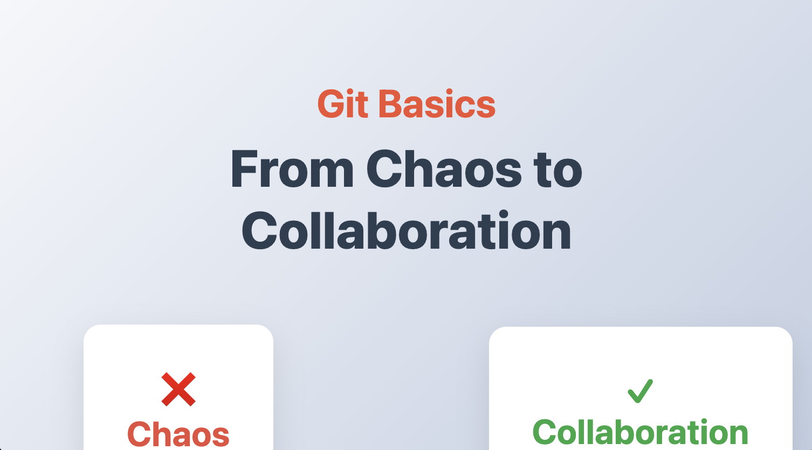
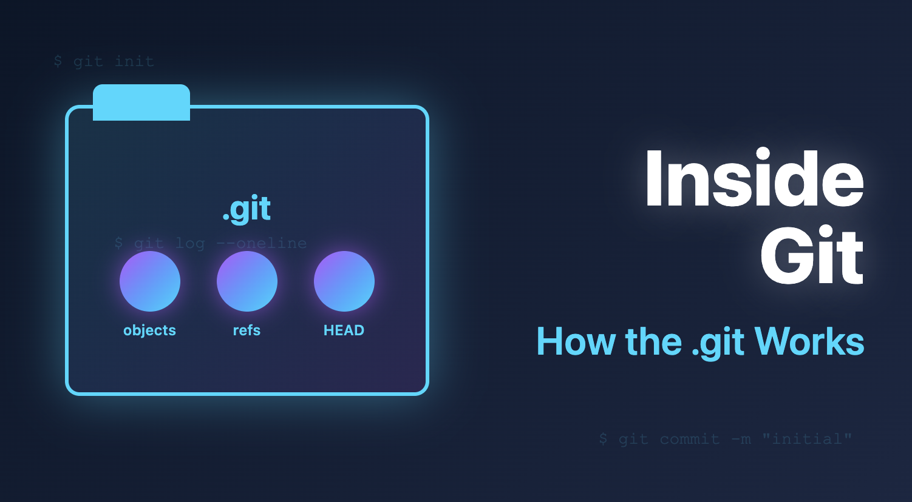
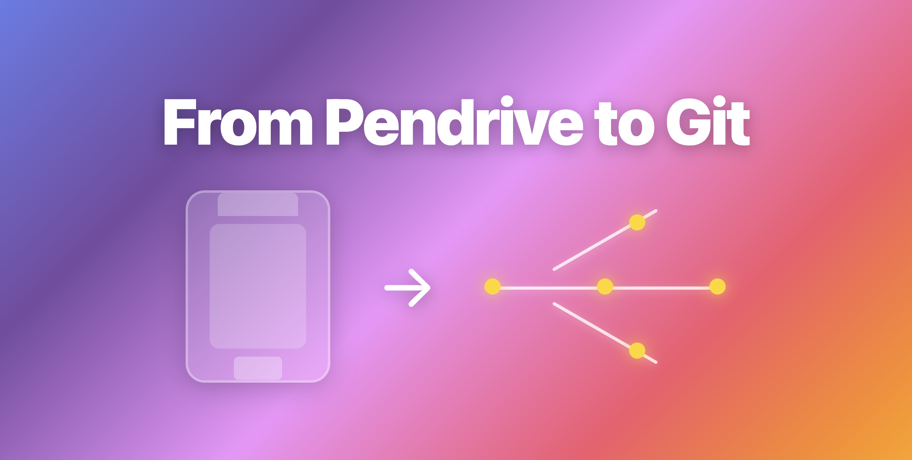
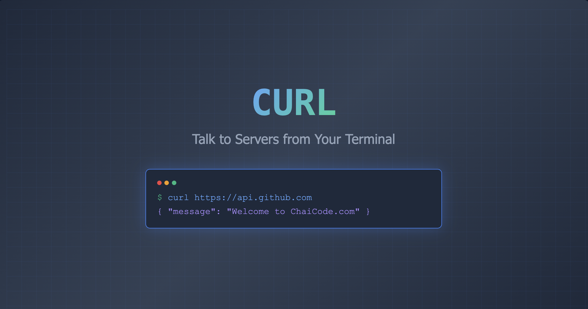
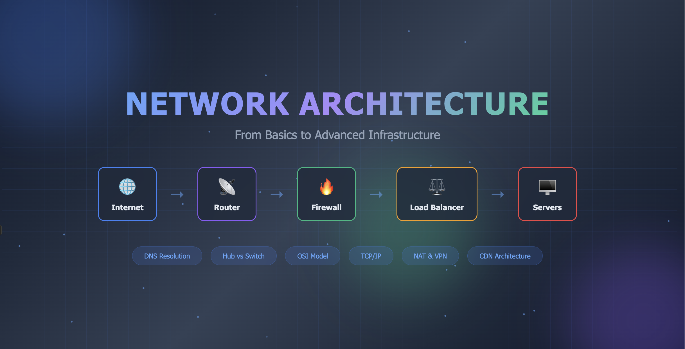

## Blogs Archive

A structured collection of technical articles documenting my journey toward building **strong engineering fundamentals**.

&nbsp;&nbsp;

These blogs focus on **core web concepts, networking fundamentals, and essential programming principles**, explained with clarity and practical intuition. The goal is not just to learn, but to **understand deeply and articulate precisely**.

### What This Collection Represents

- A learning log backed by hands-on exploration
- Clear, beginner-friendly explanations of foundational topics
- Emphasis on _why_ things work, not just _how_
- Concepts broken down through real-world analogies and visuals

### Writing Approach

Each article is written after deliberate study and experimentation, with a focus on:

- Simplicity over jargon
- Accuracy over abstraction
- Fundamentals over frameworks

### Read the Blogs

All articles are available at:

### [Git for Beginners — Basics and Essential Commands](https://git-basics-from-chaos-to-collaboration.hashnode.dev/understanding-git-from-collaboration-chaos-to-version-control)

  <a href="https://git-basics-from-chaos-to-collaboration.hashnode.dev/understanding-git-from-collaboration-chaos-to-version-control">
      

      
    

  </a>

 

### [Inside Git: How It Works and the Role of the .git Folder](https://inside-git-how-the-git-folder-works.hashnode.dev/inside-git-how-it-works-and-the-role-of-the-git-folder)

  <a href="https://inside-git-how-the-git-folder-works.hashnode.dev/inside-git-how-it-works-and-the-role-of-the-git-folder">
      

      
    

  </a>

 

### [Why Version Control Exists: The Pendrive Problem](https://from-pendrive-to-git.hashnode.dev/why-version-control-exists-the-pendrive-problem)

  <a href="https://from-pendrive-to-git.hashnode.dev/why-version-control-exists-the-pendrive-problem">
      

      
    

  </a>

 

### [CURL Command-Line Tool : Explained for Beginners](https://curl-for-beginners-explained-simply.hashnode.dev/curl-command-line-tool-explained-for-beginners?t=1768718387819)

  <a href="https://curl-for-beginners-explained-simply.hashnode.dev/curl-command-line-tool-explained-for-beginners?t=1768718387819">
      

      
    

  </a>

 

### [Understanding Network Devices: Modem, Router, Switch Explained Simply](https://how-internet-reaches-our-device.hashnode.dev/understanding-network-devices-modem-router-switch-explained-simply?showSharer=true)

  <a href="https://how-internet-reaches-our-device.hashnode.dev/understanding-network-devices-modem-router-switch-explained-simply?showSharer=true">
      

      
    

  </a>

 

### [How DNS Resolution Works](https://dns-basics-explained-simply.hashnode.dev/how-dns-resolution-works?t=1768799536900)

  <a href="https://dns-basics-explained-simply.hashnode.dev/how-dns-resolution-works?t=1768799536900">
      

      
    

  </a>

 

### [TCP vs UDP: When to Use What, and How TCP Relates to HTTP](https://tcp-vs-udp-vs-http-explained-simply.hashnode.dev/tcp-vs-udp-when-to-use-what-and-how-tcp-relates-to-http)

  <a href="https://tcp-vs-udp-vs-http-explained-simply.hashnode.dev/tcp-vs-udp-when-to-use-what-and-how-tcp-relates-to-http">
      

      
    

  </a>

 

### Contributions & Feedback

Constructive feedback, suggestions, and improvements are welcome.  
See [CONTRIBUTING.md](../CONTRIBUTING.md) for ways to get started.
  
